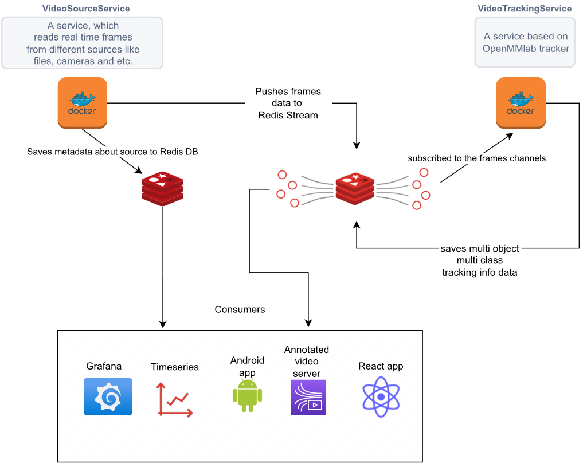

 

### Video Source Service:

The Video Source Service is responsible for collecting video streams from various sources, such as cameras or files, and pushing the data into a Redis database. In addition, it stores metadata into another Redis database.

This service is implemented as a Docker container.

### Video Tracking Service:

The Video Tracking Service is based on the open mmlab tracker. It takes an input stream from Redis and adds tracking information to the stream, which is then saved back to Redis.

After the Video Tracking Service has processed the data, consumers are able to view the data in the Redis stream (which now includes tracking information) and the metadata through Grafana dashboards and annotated video servers, as well as any Android or React applications.

Similar to the Video Source Service, the Video Tracking Service and Redis databases are also running as Docker containers.
