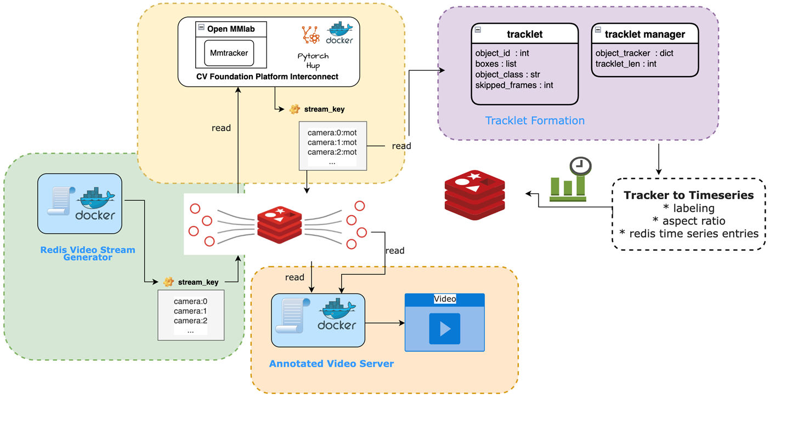

## INTRODUCTION:

DeepVision is a comprehensive video analytics system that enables users to monitor and analyze video streams from various sources with ease

### Features
* #### Scalable and modular serverless open-source framework
  * State-of-the-art object detectors, trackers, behavior detectors
  * New types of reasoning engines
  * 3D semantics projects
  * Multi-modal data stream analytics
  * Neurosymbolic integration
  * Knowledge representation
  * Self supervised learning 
  * Hyperdimensional Computing

### Overview

