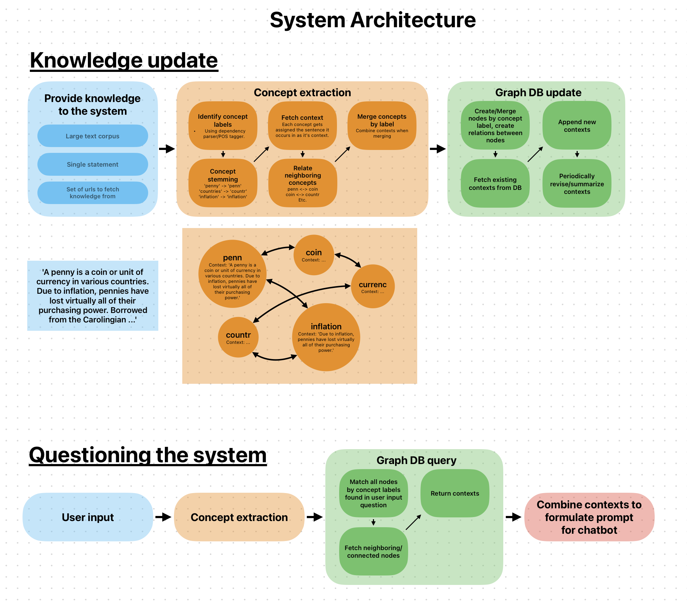

# Recall LM

RecallM provides a system for temporal context understanding and question answering by providing large language models with an updatable, temporal, persistent, long-term memory mechanism. RecallM achieves this long-term memory using a graph database approach. Our approach generates a deep and rich knowledge graph that is capable of capturing complex and temporal relations between abstract concepts.

RecallLM is intended to work in the same manner as a typical chatbot, while retaining any new information provided to it.


***

## Installation Instructions
Navigate to this subdirectory then follow these instructions to install and use RecallM:
- Clone submodules:
```
> git submodule update --init --recursive
```
- Create the api keys json file by executing the following command. Replace <API_KEY> with your OpenAI api key:
```
> echo {"open_ai":"<API_KEY>"} > api_keys.json
```
- Ensure that you have Docker installed, then create the Docker container:
```
> docker compose up -d
```
- Pip install required packages: (Ideally in a new environment)
```
> pip install -r requirements.txt
```
- Start Recall LM using:
```
> python recall.py
```
- For more details use:
```
> python recall.py --help
```