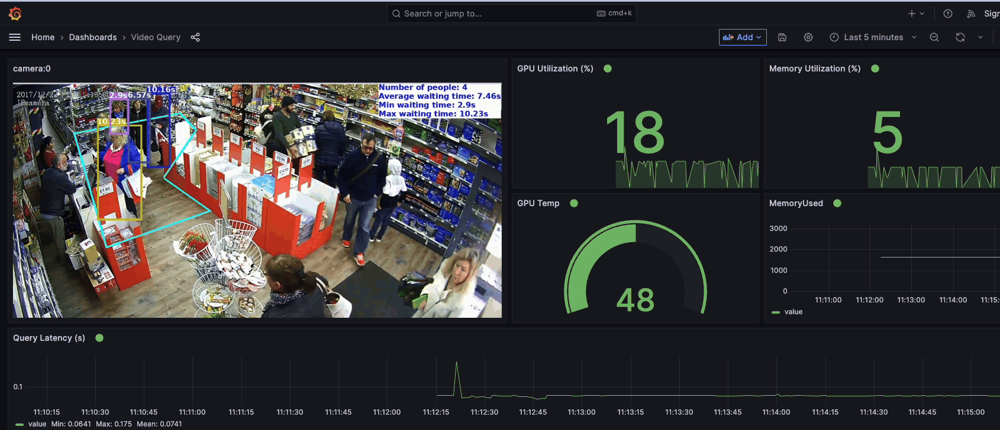

# Video Query

The video query service enables users to execute specific queries on videos to identify and monitor objects/events of interest. This service utilizes the power of the VQPy framework, an object-oriented video query framework based on Python. 

For more information about the VQPy framework, please refer to the [VQPy GitHub repository](https://github.com/vqpy/vqpy). 

## Examples

Using the constructs provided by VQPy, various video queries can be easily formulated. Here are some examples of queries made possible with the Deep Vision + VQPy integration:

#### [Loitering detection](loitering.py)

**Description**: Detects and sends alerts when individuals loiter in designated areas beyond set time thresholds.

**Applications**: Real-time safety alerts for smart cities to prevent potential risks such as suicides on infrastructure, retail store burglaries, and parking lot assaults, .etc.


#### [Queue Analysis]()

**Description**: Analyze queue metrics such as the number of people waiting, average/min/max waiting times, etc.

**Applications**: Useful for optimizing retail store operations, crowd management, and more.




## Getting Started

### Prerequisites

Ensure you are in the root directory of the DeepVision project.

### Commands

- **Start the Service:**

  ```
  ./run query up videoquery/.env
  ```

- **Build and Start the Service:**

  ```
  ./run query up videoquery/.env --build
  ```

- **Shut down the Service:**

  ```
  ./run query down
  ```

>  **Tip**: You can easily switch between query applications or modify query configurations via the `videoquery/.env` file.

## Visualization Dashboard

For real-time visualization of query results, head to the "Video Query" dashboard.
